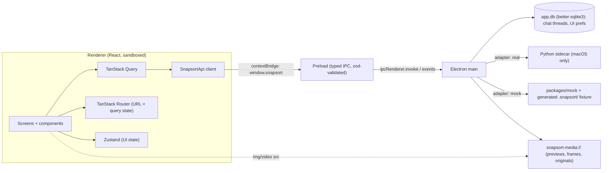

# snapsort — Frontend Execution Plan (rev 2)


> [!NOTE]
> **Rev 2** applies `frontend_plan_changes.md`, scoped to the README + TASKS planned scope.
> - **Removed**: transcripts, OCR, speech/on-screen text in `q`, Scene/Tags + `/tags`, capture dates, `peopleCount`, folder watching/pause/remove/progress, and people merge/hide/reassign.
> - **Added**: image search (`similarTo`), per-frame video timeline matching, Objects facet, detection overlays, and search tools in chat.
> - **Changed**: places keyed by name, sort by date added, previews as a backend dependency, `image | video` kinds and integer IDs.
> - **On hold**: outfits.

## 1. Locked decisions

| # | Topic | Decision |
|---|---|---|
| 1 | Platform | **React + Vite + TypeScript**, desktop-first 3-pane UI in **Electron for macOS**. Dev on Windows against a mock API + sample `.snapsort/` fixture. The Python backend runs on Mac only, bundled as a **sidecar**. Build/sign/notarize on a macOS CI runner. UI state in a separate **`app.db`**. |
| 2 | Transport | Renderer → typed **preload IPC bridge** → Electron main → sidecar. Media through a custom **`snapsort-media://`** protocol. |
| 3 | Styling | **Tailwind CSS v4** + CSS-variable tokens + **Radix** primitives (shadcn-style, owned in repo). |
| 4 | State | **TanStack Query** (server data) + **Zustand** (UI state) + **TanStack Router** (query state in typed URL search params). |
| 5 | Card outline | Filters **hide** non-matches by default. A "Show all, highlight matches" toggle switches to the yellow-outline mode. |
| 6 | AI ↔ query | AI tool calls set **`q`, `similarTo` and `Filter[]`**. The results appear as normal editable/removable chips with a ✦ marker. Suggestion pills apply instantly. Each AI message gets an Undo. |
| 7 | v1 scope | Library grid (incl. image search) · Ask AI panel · Media viewer (detections + timeline matches) · Add folder / Rescan · People (grid, detail, rename). |
| 8 | Grid | Uniform **16:10** cards, **TanStack Virtual**, responsive columns, S/M/L size slider. Video cards show the **best-matching frame**. No date-group headers. |
| 9 | Branding | Wordmark redrawn as an **inline SVG** (`currentColor` letters, yellow bracket-"o"). `icon.png` → `.icns` / app icon. |
| 10 | Theme | **Dark-only** v1 (token structure ready for light). Bundled **Plus Jakarta Sans**, tabular numerals. |
| 11 | Window | `titleBarStyle: 'hiddenInset'`, solid sidebar, native menu + shortcuts. Min size 1024×640. AI panel becomes a drawer below 1200px. |
| 12 | Contract | **Contract-first**: `SnapsortApi` + zod schemas + label manifest, drafted by the frontend and sent to the backend team. Mock reads a generated fixture. |
| 13 | AI panel | Streamed replies, visible tool steps, threads in `app.db`, "New chat". The chatbot's tools are **search + filters**. Clear model-loading/unavailable states. |
| 14 | Tooling | pnpm workspace, electron-vite, electron-builder, Vitest + Testing Library, Playwright-Electron, Storybook, ESLint/Prettier, strict TS. |
| 15 | Folders | Folders are ingest sources. **Add folder** and **Rescan** only, and both run ingest (which only processes new files and new modules). No watching, pause, remove or progress bars. |
| 16 | People | Cluster grid → person detail with **inline rename**. Nothing else in v1. |
| 17 | Image search | Upload, drop or paste an image into the search bar, or use **Find similar** on cards and in the viewer. Results sort by similarity. |
| 18 | Video matching | Results are matched **per frame (1 fps)** with timestamps. Cards show the best frame. The viewer marks matches on the scrubber and opens at the first match. |
| 19 | Previews | **Backend task requested**: one small JPEG/WebP preview per image (incl. HEIC). Videos use the existing 1 fps frames. Until it ships, the mock serves previews. |
| 20 | Schema | Media kind is `image \| video`. All IDs are **integers**. |

**On hold**: Outfits facet. It gets added only if the feasibility check passes.

---

## 2. Architecture



- **Single seam**: `SnapsortApi` (in `packages/contract`). Main picks the `real` or `mock` adapter from `SNAPSORT_BACKEND=mock|sidecar` (default `mock` on Windows).
- **Image queries**: dropped or pasted images are sent through IPC to main, which stages them as a temp file and returns an `imageRef` token. The raw bytes never sit in the URL.
- **Storybook** runs the renderer with an in-browser mock adapter.
- **Security**: `contextIsolation: true`, `nodeIntegration: false`, `sandbox: true`, strict CSP (`img-src 'self' snapsort-media: blob:; media-src snapsort-media:`). The IPC channel allowlist is generated from the contract.

---

## 3. Repo layout

```
snapsort/
├─ assets/                     # icon.png, wordmark.png (source art)
├─ apps/desktop/
│  ├─ electron.vite.config.ts
│  ├─ electron-builder.yml     # dmg, hardened runtime, notarize, extraResources: sidecar
│  ├─ src/main/                # window, menu, ipc handlers, adapters/, media-protocol, image-staging, app-db
│  ├─ src/preload/             # contextBridge → window.snapsort (typed)
│  └─ src/renderer/
│     ├─ routes/               # TanStack Router file routes
│     ├─ features/             # library/, image-search/, viewer/, ai/, folders/, people/
│     ├─ stores/               # zustand slices
│     └─ lib/                  # query keys, search-param codec, hotkeys
├─ packages/contract/          # SnapsortApi types, zod schemas, filter model, label manifest
├─ packages/mock/              # fixture generator CLI + mock adapter + scripted AI responder
├─ packages/ui/                # tokens.css, Tailwind preset, primitives, Wordmark.tsx, icons
└─ .github/workflows/          # ci.yml (lint, typecheck, test), release-mac.yml
```

---

## 4. Design system (derived from the reference)

| Token | Value | Use |
|---|---|---|
| `--surface-0` | `#0F0F0F` | App background / AI pane |
| `--surface-1` | `#141414` | Sidebar, main pane |
| `--surface-2` | `#1C1C1C` | AI bubbles, popovers |
| `--surface-3` | `#262626` | Card placeholder, hover |
| `--border` | `#2A2A2A` | Pills, inputs, dividers |
| `--text` | `#F5F5F5` | Primary |
| `--text-muted` | `#8A8A8A` | Labels, captions, counts |
| `--accent` | `#FFC400` | Primary button, active chips, match outline, user bubble, scrubber match marks, face boxes |
| `--accent-ink` | `#111111` | Text on accent |
| `--overlay-object` | `#5AC8FA` | Object detection boxes, so they read differently from face boxes |
| `--danger` | `#FF5A4E` | Errors |

- **Radius**: pills `9999px`, cards `10px`, panels/inputs `14px`. **Spacing**: 4px base.
- **Type**: Plus Jakarta Sans (bundled woff2). Title 28/700, section label 11/600 uppercase, body 13/500, caption 11/500, tabular numerals.
- **Motion**: 120–180ms ease-out, disabled under `prefers-reduced-motion`.
- **Brand**: `<Wordmark />` + `<BracketMark />`. The bracket mark doubles as the drop target outline for image search and as the ingest busy animation.

**Component inventory → reference mapping**

| Reference element | Component |
|---|---|
| Logo + "+ Add folder" | `SidebarHeader`, `Button variant=accent size=lg` |
| LIBRARY: All footage / Images / Videos | `NavSection`, `NavItem` (label, count, active) |
| EXPLORE: People / Places / **Objects** | `NavItem` (replaces "Tags") |
| FOLDERS list | `FolderItem` (busy spinner while ingesting; context menu: Reveal in Finder, Rescan) |
| Footer "Local library · runs on this device" | `SidebarFooter` (shows "Ingesting Ceremony…" while busy) |
| Search bar + Filter | `SearchField` (⌘F) with an **image button / drop / paste** slot, `FilterPopover` |
| Count line "248 items · 66 clips · 182 photos" | `ScopeHeader` → "248 items · 66 videos · 182 images" |
| Sort menu | `SortMenu`: Best match · Similarity · Name · Newest added · Oldest added |
| Facet pills | `FacetPill` **People / Objects / Places** (replaces People / Scene / Tags) |
| Active chips (e.g. "Groom + Bride") | `FilterChip` (✦ if AI, × remove, click to edit), `SimilarChip` (mini thumb + "Similar to IMG_2031") |
| Media cards | `MediaCard` (preview or best frame, duration badge, match-count badge "3 moments" on videos, caption, match ring, selection check, hover "Find similar") |
| Ask AI pane | `AiPanel` → `ChatThread`, `UserBubble`, `AssistantMessage`, `ToolStep`, `AppliedQuery`, `SuggestionPills`, `Composer` |

---

## 5. Query model (single source of truth, in the URL)

```ts
// packages/contract/query.ts
type Source = 'user' | 'ai';
type Filter =
  | { kind: 'person';    ids: number[]; match: 'all' | 'any'; source: Source }
  | { kind: 'label';     module: string; labelId: string;     source: Source } // objects (outfits later, if feasible)
  | { kind: 'place';     name: string;                        source: Source } // keyed by place name
  | { kind: 'mediaKind'; value: 'image' | 'video';            source: Source } // e.g. AI "Only video"
  | { kind: 'folder';    id: number;                          source: Source };

type SimilarTo =
  | { mediaId: number; ts?: number; source: Source }  // "Find similar" on a card / viewer frame
  | { imageRef: string; source: Source };             // uploaded, dropped or pasted image (staged by main)

interface LibrarySearch {
  scope: 'all' | 'images' | 'videos';
  q?: string;                          // visual semantic search (text-image embedding) only
  similarTo?: SimilarTo;
  f: Filter[];
  sort: 'relevance' | 'similarity' | 'name' | 'newest' | 'oldest'; // newest/oldest = date added
  view: 'filter' | 'highlight';
  media?: number;                      // viewer overlay → Back closes it
  t?: number;                          // viewer timestamp (seconds) for videos
}
```

- Default sort: `similarity` if `similarTo` is set, otherwise `relevance` if `q` is set, otherwise `newest`.
- **Routes**: `/library` · `/people` · `/people/$personId` · `/places/$placeName` (URL-encoded) · `/objects` (label list with counts; a label click opens `/library` with that `label` filter) · `/folders/$folderId`. Every grid route reuses `LibrarySearch`.

---

## 6. API contract sketch (`packages/contract`)

```ts
type MediaKind = 'image' | 'video';

interface FrameMatch { ts: number; score: number }           // 1 fps frames
interface MediaSummary {
  id: number; kind: MediaKind; name: string; folderId: number; addedAt: string;
  durationS?: number; faceCount: number;
  score?: number;                    // relevance / similarity when q or similarTo is set
  matches?: FrameMatch[];            // videos only, sorted by ts
  bestFrameTs?: number;              // card shows this frame
}
interface Box { x: number; y: number; w: number; h: number } // normalized 0..1
interface Detections {
  faces:   { personId: number | null; box: Box }[];
  objects: { labelId: string; box: Box; score: number }[];
}
interface MediaDetail extends MediaSummary {
  path: string; width: number; height: number;
  place?: { name: string; lat: number; lon: number };
  people: { id: number; name: string | null }[];
  labels: { module: string; labelId: string }[];
  frames?: number[];                 // available frame timestamps (videos)
}

interface SnapsortApi {
  // library + search
  query(req: { search: LibrarySearch; cursor?: string; limit: number }):
    Promise<{ items: MediaSummary[]; nextCursor?: string; total: number; matched: number;
              facets: { images: number; videos: number } }>;
  getMedia(id: number): Promise<MediaDetail>;
  getDetections(id: number, ts?: number): Promise<Detections>;   // ts for video frames
  stageQueryImage(input: { path: string } | { bytes: ArrayBuffer; mime: string }): Promise<{ imageRef: string }>;
  getCounts(): Promise<SidebarCounts>;
  getLabelManifest(): Promise<LabelManifest>;                     // object labels (outfits later)
  listPlaces(): Promise<{ name: string; lat: number; lon: number; count: number }[]>;

  // people
  listPeople(): Promise<Person[]>;                                 // { id, name|null, count, faceRef }
  renamePerson(id: number, name: string): Promise<void>;

  // folders (ingest)
  pickAndAddFolder(): Promise<{ folder: Folder; result: IngestResult } | null>; // native dialog, runs ingest
  rescanFolder(id: number): Promise<IngestResult>;                 // new files + new modules only
  listFolders(): Promise<Folder[]>;                                // { id, name, path, busy }
  revealInFinder(id: number): Promise<void>;

  // AI (streamed); tools = search + filters
  chat(req: { threadId: number; text: string; current: LibrarySearch }): ChatStream;
  //   emits: token | toolCall(QueryPatch) | done | error(modelState)
  //   QueryPatch = { q?: string | null; similarTo?: SimilarTo | null; filters?: { add?: Filter[]; remove?: number[] } }
  listThreads(): Promise<Thread[]>; getThread(id: number): Promise<ThreadDetail>;
}
// media URLs:
//   snapsort-media://preview/<id>       image preview (backend task; HEIC-safe)
//   snapsort-media://frame/<id>/<ts>    1 fps video frame
//   snapsort-media://file/<id>          original (viewer, video playback with range requests)
```

**Deliverable to the backend team** (end of Milestone 1): `CONTRACT.md` generated from these types, the label-manifest proposal, the fixture folder layout, the **preview task request**, and the questions in §9.

---

## 7. Screen specs (v1)

1. **Library grid**
   - Same layout as the reference. Facet pills are **People / Objects / Places**, and each opens a searchable picker.
   - Visual `q` search is debounced at 250ms.
   - The count line reads `36 of 248 items` when filtered.
   - Video cards show the best-matching frame plus a "N moments" badge, and play a muted hover preview starting at that frame.
   - **Find similar** appears as a hover action on each card.
   - Keyboard: arrows move focus, Enter/Space opens the viewer, Shift/⌘-click selects, Esc clears.
   - Empty, no-results and error states are designed.
2. **Image search**
   - An image button in the search bar opens a file picker. Dropping an image anywhere on the main pane shows a bracket-outlined drop zone. ⌘V pastes from the clipboard.
   - The query shows as a `SimilarChip` with a mini thumbnail, and sort switches to Similarity.
   - The chip can combine with `q` and filters, e.g. "similar vibe, only with Anna".
3. **Ask AI panel**
   - User messages are yellow bubbles. Assistant messages are dark cards with `ToolStep` rows, then `AppliedQuery` chips covering `q`, similar-to and filters.
   - Includes suggestions, Stop, Undo per message, New chat and history.
   - States: model loading, model unavailable, error. ⌘J toggles the panel.
4. **Media viewer**
   - Full-window overlay; the URL holds `media` + `t`.
   - Images get zoom/pan.
   - Videos get a player whose scrubber shows **match marks** from `matches[]`. The viewer opens at the first match (or at `t`), and N / Shift+N jump to the next or previous match.
   - **Detection overlay** toggle (D): face boxes (accent, with name labels) and object boxes (`--overlay-object`, with label text) drawn on the image or the current frame. For video, boxes update on the nearest 1 fps frame while paused and hide during playback.
   - Info panel: people (links to the person page), objects, place (name + coordinates), date added, folder path. **Find similar** uses the current image or the current frame (`mediaId` + `ts`).
   - ←/→ step through the current result set.
5. **Folders (ingest)**
   - "+ Add folder" (⌘O) opens the native picker and runs ingest. While it runs, the folder row shows a spinner and the footer reads "Ingesting Ceremony…".
   - When ingest finishes, a toast says "Added 124 new files", and the grid, counts, people and places refresh.
   - The context menu has Reveal in Finder and Rescan. Rescan runs ingest the same way.
   - There is no progress percentage, pause, remove or per-file error list.
6. **People**: cluster grid with circular face crops, named clusters first and then "Unnamed". The person detail page has an inline name field above the scoped grid. Renaming makes the name available to the chips and to the AI.

---

## 8. Milestones

| M | Deliverable | Verification |
|---|---|---|
| **0. Foundations** | Workspace, electron-vite app boots on Windows, security + CSP, Tailwind v4 + tokens, font, `Wordmark`/`BracketMark`, Storybook, lint/TS strict, CI | `pnpm dev` opens window; Storybook shows tokens + brand; CI green |
| **1. Contract + mock** | `packages/contract` (types + zod), fixture generator (`pnpm fixture` → ~300 items incl. some HEIC, ~20 videos with 1 fps frames, per-frame face/object detections, 6 people, places with name + lat/lon, object labels, previews), mock adapter (latency/error injection, fake similarity scores, per-frame matches), scripted AI responder emitting `QueryPatch`, IPC bridge, `snapsort-media://`, image staging | Contract tests; renderer queries the mock over IPC; previews and frames load via the protocol; **CONTRACT.md + preview task request sent to the backend team** |
| **2. App shell** | 3-pane layout, hiddenInset chrome + drag regions, sidebar (Library / Explore incl. Objects / Folders) with live counts, router + search-param codec, native menu + shortcuts, responsive AI drawer | Playwright: navigation + URL round-trip; visual check against the reference |
| **3. Library grid + image search** | SearchField (text + image upload/drop/paste), People/Objects/Places pickers, FilterChips, SimilarChip, SortMenu, filter/highlight toggle, VirtualMediaGrid with infinite query, best-frame video cards + moment badges, size slider, selection, Find similar | 10k-item fixture scrolls at 60fps; codec tests; RTL tests for chips + image drop |
| **4. Media viewer** | Overlay, image zoom, video player with range requests, scrubber match marks + first-match open, detection overlays, info panel, Find similar from a frame, prev/next | Playwright: open at first match, N jumps, D toggles boxes, Back closes |
| **5. Ask AI** | Streaming chat over IPC events, ToolStep → `q`/similar/filter chips (✦), Undo, suggestions, threads in `app.db`, model states | Mock prompt *"Group all images where the groom and bride are visible"* produces person(groom, bride, all) + mediaKind(image) chips, matching the reference minus "Max 2 people" |
| **6. Folders (ingest)** | Add folder (native dialog → ingest), Rescan, busy row + footer, completion toast, query invalidation, Reveal in Finder | Mock ingest adds files; counts and grid refresh |
| **7. People** | Cluster grid, person detail, inline rename | RTL + Playwright rename; AI can target the renamed person |
| **8. Polish + packaging** | Empty/loading/error states, a11y pass, reduced motion, perf budget, electron-builder dmg + `.icns`, `release-mac.yml` (sign + notarize, sidecar in `extraResources`) | Smoke suite green; dmg builds in CI; signed once certs are in secrets |

Milestones 0–3 deliver a clickable replica of the reference (with image search) on Windows. Milestones 4–7 can run in parallel once the shell exists.

---

## 9. Open items for the backend team

> [!IMPORTANT]
> These don't block Milestones 0–3 (the mock covers them), but they need answers before the real sidecar adapter is written.

1. **Preview task (dependency)**: one ~512px JPEG/WebP preview per image during ingest, HEIC included, served under `.snapsort/`. Videos use the existing 1 fps frames.
2. Sidecar transport: stdio JSON-RPC, local HTTP/UDS, or gRPC?
3. Chat streaming format, and the tool schemas for **search** (`q`, `similarTo`) and **filters**. Ideally they match `QueryPatch` exactly.
4. Image query input: does the sidecar accept a file path from main's staging dir, or raw bytes?
5. Video matching response: per-frame `{ ts, score }` list shape, how many matches are returned per video, and how the best frame is chosen.
6. Detection format: box coordinates (normalized vs pixels), whether per-frame detections exist for every 1 fps frame, and how faces link to person IDs.
7. Places: are names canonicalized (case, language), and what happens when two different locations share a name? The `place` filter is keyed by name.
8. Ingest: result shape (new files, new modules run), typical duration, cancellation, and how the UI knows a folder is still busy after an app restart.
9. Label manifest for the object module (ids, display names, icons). Outfits get added later if the feasibility check passes.
10. Is `.snapsort/` created per source folder or as one central index?

---

## 10. Risks

> [!WARNING]
> - **Long ingest without progress**: the user only sees a spinner. Mitigation: a clear busy state, the elapsed time in the footer, and a completion toast. If ingest turns out to take hours, revisit progress events.
> - **Previews depend on the backend**: until the preview task ships, a real library with HEIC shows placeholders. Mitigation: the mock covers it, and the dependency is tracked in §9.
> - **Name-keyed places**: duplicate names can merge different locations. This depends on the backend's answer to §9.7.
> - **Windows dev vs macOS target**: chrome, menu and Finder reveal are Mac-only. Mitigation: platform guards + a Mac CI smoke run on `src/main` changes.
> - **Contract drift**: zod validation at the IPC boundary; contract changes go through `packages/contract` only.
> - **Large-library performance**: virtualization, cursor paging, previews instead of originals; Milestone 3 has a 10k-item perf gate.
